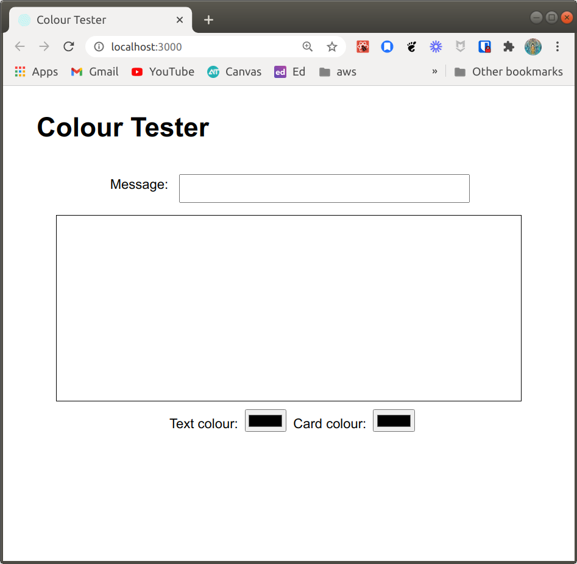

# React Hooks Challenge

## Setup

1. Make a fork of this repo
2. Clone your fork to your local development environment
3. Change to the project directory
4. Install dependencies: `yarn install`
5. Run the application: `yarn start`
6. Verify the application runs as expected

### What you should see
This is a simple application that allows the user to try out different colour schemes for background and text colours.



## Challenge
All of the components are defined for this challenge, but you need to add state management with the `useState` hook.

When you are done with the challenge, it should work like what you see in this video:
[Complete app example]https://youtu.be/i_M3xKgcskE)

**Before you begin**

Follow the instructions to clone and verify the application scaffold is running as expected. 

Examine the code and the components that make up the app. Decide where state should be defined, and how that state information will be shared between the components. You could practice drawing a component diagram to show this information, like what was shown in the video for this lesson. 

**Part 1: Implement state in the application with the useState hook**

**Objective 1**: Make the message typed into MessageField appear in MessageCard
- with the MessageCard text colour and background colours
- set to the values currently selected in the ColourChoicePanel
	
 1. Right now the message, text colour, and background(card) colour are managed as local variables. Add state to manage them properly (hint - start in App.js).
 2. Implement controlled components in MessageField and ColourChoicePanel
    that update the state values
 3. Pass the state values and state value modifying functions to components as needed to complete the objective

**Objective 2**: Make the button click set the message displayed to a random dad joke

1. In MessageField, complete the implementation of the `handleClick` function for the Surprise me button to update the message in the state so that it appears on the card

**Part 2: Implement an effect to display a joke on component load**

Effects are things that we want to happen when a component loads, updates, or unmounts. With class components we do that by overriding the lifecycle methods, and with functional components we do it with the useEffect hook. 

For this part of the challenge, you will set the message to a random joke from https://icanhazdadjoke.com when the app loads. This is an effect that should run for componentDidMount, and in the lesson you saw how to create an effect that runs only on mount with useEffect. 

The first question is which component?

The state is managed from App, and this effect will modify state, because it will update the message displayed by the application. When you can, the best design choice is to put the effect in the same component that owns the state if state is being modified by the effect. Sometimes this isn't possible, or isn't the best choice, but in this case it really is.

Use the `useEffect` hook to execute a fetch when the App component mounts and display a random quote on the card. You can use the `getJoke` function in `utils/Services` to accomplish this, or you can do something else if you like. 

The effect should only execute when the component mounts, not when it updates, so pay attention to your dependency array (the second argument to `useEffect`).

**Bonus Fun**

**Refactor app to use a reducer**

Now that you have mastered the useState hook, refactor the application to use a reducer function and the `useReducer` hook. The reducer implementation should:
- define a single state object with properties for each value
- use a reducer function to implement changes to any of the state values
- replace any calls to useState in your application

This bonus isn't tested, but your changes should not break any existing tests. You can see an example implementation in the challege-complete-reducer branch.

## Tests and Submitting

Note that the tests for this challenge use the `data-testid` attribute, which you will find in the application code. Leave those attributes in place or the tests will fail. Here's an example:

```html
<input name='text-colour'
	data-testid='text-colour'
	type='color'	
/>
```

At any time you can run `yarn test` to see your progress. By default it will run in `watch` mode, and you will have to press `q` to quit. It will run the automated tests against your code and let you know what your progress is so far. Once you have all the tests passing, you can submit your challenge. To do this make sure you have committed your work:

1. From the project root `git add .` and add all the files changed in this folder
2. Commit these files to your repository `git commit -m "challenge completed"`
3. Make sure your working tree is clear `git status`
4. Push these files to your github repository (master or main branch) `git push origin master`
5. Log on to Github and visit your fork of this challenge.
6. Make a pull request to the main branch.
7. Wait and watch the final tests run, if you are successful it will automatically let your educators know you are finished.

## Example solution

An example solution can be found in the challenge-complete branch of this repository. A solution with a reducer instead of useState is in challenge-complete-reducer.